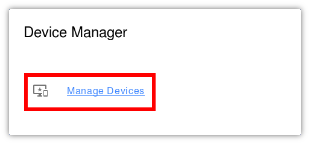

User's Manual
=============

To add your device's MAC address, click on the 'Manage Devices' link
on the Constellation dashboard:

After loading the Manage Devices screen, you will see two cards.  The
first card shows devices that you already have registered:

.. image:: img/registered.png
   :scale: 75%
   :align: center

Devices can be deleted by clicking on the 'X' next to them in the
list.  Devices will be shown with the MAC address as well as the
friendly name.  It is not possible to edit devices, you will need to
remove and then create the device again if you need to change the
information in a particular device's record.

The second card on the page is the new device form:

The MAC address refers to the physical address of the network card in
your computer.  Specific instructions for your operating system can be
found as part of the Vendor's documentation.

The Device Friendly Name can be any name that makes sense to you, its
just used to show the device in the list.

The Device Hostname should be a short identifier composed of letters,
numbers, and dashes.  For the curious, you can read the RFC_.

.. _RFC: https://tools.ietf.org/html/rfc1035

Once you have completed the new device form, click "Add Device" and it
will be added to your account.  Depending on how your System
Administrator has configured the system reading from Constellation,
updates may not appear for several minutes.
